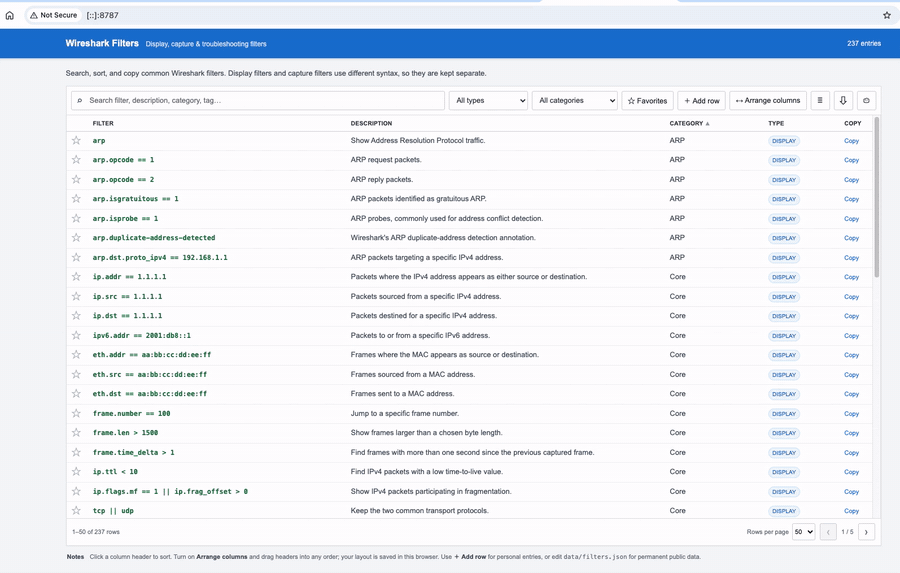

# Wireshark Filters

A searchable local reference for Wireshark display filters, capture filters, and troubleshooting recipes.



## Run locally

Clone the repo:

```bash
git clone https://github.com/j86schroeder/wireshark-filters.git
cd wireshark-filters
```

Start a local web server:

```bash
python3 -m http.server 8787
```

Then open:

```text
http://localhost:8787
```

Press `Control-C` in Terminal to stop the server.

### macOS shortcut

You can also run:

```bash
./start.command
```

That starts the server and opens the site in your default browser.

## Features

- 200+ filters and recipes
- Search, sort, filter, and paginate
- Drag-and-drop column ordering
- One-click copy and favorites
- Add personal filters in the browser
- CSV export and print view
- No framework or backend

## Add filters

Permanent filters live in `data/filters.json`.

After editing it:

```bash
python3 scripts/build_data.py
python3 scripts/validate_filters.py
```

The **+ Add row** button can also save personal filters locally in your browser.

## License

[MIT License](LICENSE)

Wireshark is a trademark of the Wireshark Foundation. This project is independent and is not affiliated with or endorsed by the Wireshark Foundation.
